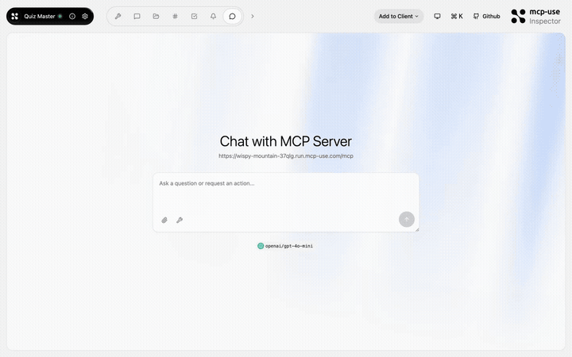
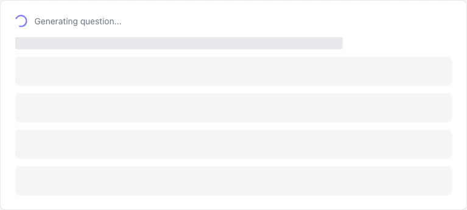

# Quiz Master — Interactive quizzes in your chat

<p>
  <a href="https://github.com/mcp-use/mcp-use">Built with <b>mcp-use</b></a>
  &nbsp;
  <a href="https://github.com/mcp-use/mcp-use">
    
  </a>
</p>

Interactive quiz MCP App. The model generates multiple-choice quizzes on any topic with a live quiz widget, progress tracking, and scoring — all rendered inside the conversation.



## Try it now

Connect to the hosted instance:

```
https://wispy-mountain-37qlg.run.mcp-use.com/mcp
```

Or open the [Inspector](https://inspector.manufact.com/inspector?autoConnect=https%3A%2F%2Fwispy-mountain-37qlg.run.mcp-use.com%2Fmcp) to test it interactively.

### Setup on ChatGPT

1. Open **Settings** > **Apps and Connectors** > **Advanced Settings** and enable **Developer Mode**
2. Go to **Connectors** > **Create**, name it "Quiz Master", paste the URL above
3. In a new chat, click **+** > **More** and select the Quiz Master connector

### Setup on Claude

1. Open **Settings** > **Connectors** > **Add custom connector**
2. Paste the URL above and save
3. The Quiz Master tools will be available in new conversations

## Features

- **Any topic** — generate quizzes on any subject
- **Multiple choice** — interactive answer selection in the widget
- **Progress tracking** — uses `ctx.reportProgress` to show quiz completion
- **Scoring** — get your score with the `get-score` tool
- **Streaming** — questions appear progressively

## Tools

| Tool | Description |
|------|-------------|
| `start-quiz` | Generate a quiz on a given topic with configurable difficulty and question count |
| `get-score` | Get the current quiz score and results |

## Available Widgets

| Widget | Preview |
|--------|---------|
| `quiz-card` |  |

## Local development

```bash
git clone https://github.com/mcp-use/mcp-quiz-master.git
cd mcp-quiz-master
npm install
npm run dev
```

## Deploy

```bash
npx mcp-use deploy
```

## Built with

- [mcp-use](https://github.com/mcp-use/mcp-use) — MCP server framework

## License

MIT
